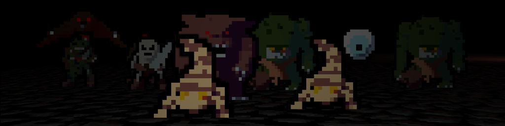
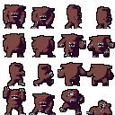

# Roguelike game

# Introduction
This game made for [Roguelike Jam](https://itch.io/jam/roguelike-jam-4) in 2 weeks.

You can play this game [on this page](https://k-aa.itch.io/doomedcorpses).  In this game i wanted to implement some classic roguelike games mechanics such as:
- random dungeon generaton
- some random effects from scrolls and wands

# Assets

For sprite assets i wrote a little script for blender that automaticly renders model from 4 sides this saved me a lot of time

